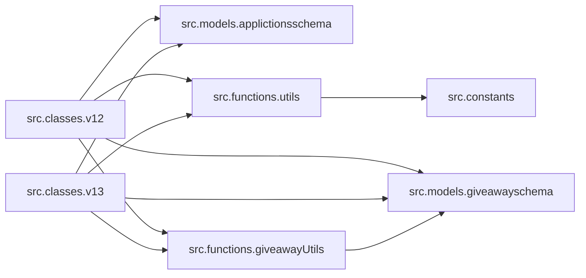

# Code Overview

[_Documentation generated by Documatic_](https://www.documatic.com?377052553)

<!---Documatic-section-Codebase Structure-start--->
## Codebase Structure

### JavaScript

The codebase has a 3-deep folder structure,
                with 22 code files in total.

<!---Documatic-block-system_architecture-start--->

<!---Documatic-block-system_architecture-end--->

### TypeScript
<!---Documatic-section-Codebase Structure-end--->

[_Documentation generated by Documatic_](https://www.documatic.com?377052553)